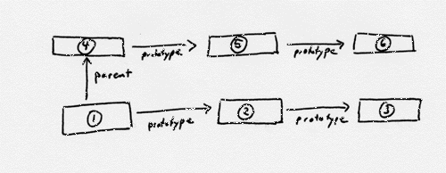
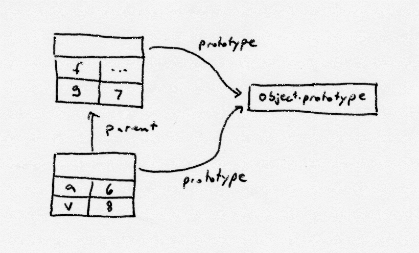

# Scopes and contexts
{: .no_toc }

{: .fs-6 .fw-300 }

## Table of contents
{: .no_toc .text-delta }

1. TOC
{:toc}

---
Before using Rhino in a concurrent environment, it is important to understand the distinction between Contexts and scopes. Both are required to execute scripts, but they play different roles. Simple embeddings of Rhino probably won't need any of the information here, but more complicated embeddings can gain performance and flexibility from the techniques described below.

## Contexts

The Rhino Context object is used to store thread-specific information about the execution environment. There should be one and only one Context associated with each thread that will be executing JavaScript.

To associate the current thread with a Context, simply call the `enter` method of Context:

```java
Context cx = Context.enter();
```

Once you are done with execution, simply exit the Context:

```java
Context.exit();
```

These calls will work properly even if there is already a Context associated with the current thread. That context will be returned and an internal counter incremented. Only when the counter reaches zero will it be disassociated from the thread.

Remember to put the `exit()` call in a `finally` block if you're executing code that could throw an exception.

## Scopes

A scope is a set of JavaScript objects. Execution of scripts requires a scope for top-level script variable storage as well as a place to find standard objects like `Function` and `Object`.

It's important to understand that a scope is independent of the Context that created it. You can create a scope using one Context and then evaluate a script using that scope and another Context (either by exiting the current context and entering another, or by executing on a different thread). You can even execute scripts on multiple threads simultaneously in the same scope. Rhino guarantees that accesses to properties of JavaScript objects are atomic across threads, but doesn't make any more guarantees for scripts executing in the same scope at the same time. If two scripts use the same scope simultaneously, the scripts are responsible for coordinating any accesses to shared variables.

A top-level scope is created by calling `Context.initStandardObjects` to create all the standard objects:

```java
ScriptableObject scope = cx.initStandardObjects();
```

The easiest way to embed Rhino is just to create a new scope this way whenever you need one. However, `initStandardObjects` is an expensive method to call and it allocates a fair amount of memory. We'll see below that there are ways to share a scope created this way among multiple scopes and threads.

## Name Lookup

So how are scopes used to look up names? In general, variables are looked up by starting at the current variable object (which is different depending on what code is being executed in the program), traversing its prototype chain, and then traversing the parent chain. In the diagram below, the order in which the six objects are traversed is indicated.


**Order of lookups in a two-deep scope chain with prototypes.**

For a more concrete example, let's consider the following script:

```js
var g = 7;

function f(a) {
  var v = 8;
  x = v + a;
}

f(6);
```

We have a top-level variable `g`, and the call to `f` will create a new top-level variable `x`. All top-level variables are properties of the scope object. When we start executing `f`, the scope chain will start with the function's activation object and will end with the top-level scope (see diagram below). The activation object has two properties, 'a' for the argument, and 'v' for the variable. The top-level scope has properties for the variable `g` and the function `f`.


**An example scope chain for a simple script.**

When the statement `x = v + a;` is executed, the scope chain is traversed looking for a 'x' property. When none is found, a new property 'x' is created in the top-level scope.

## Sharing Scopes

JavaScript is a language that uses delegation rather than traditional class-based inheritance. This is a large topic in itself, but for our purposes it gives us an easy way to share a set of read-only variables across multiple scopes.

To do this we set an object's prototype. When accessing a property of an object in JavaScript, the object is first searched for a property with the given name. If none is found, the object's prototype is searched. This continues until either the object is found or the end of the prototype chain is reached.

So to share information across multiple scopes, we first create the object we wish to share. Typically this object will have been created with `initStandardObjects` and may also have additional objects specific to the embedding. Then all we need to do is create a new object and call its `setPrototype`method to set the prototype to the shared object, and the parent of the new scope to null:

```java
Scriptable newScope = cx.newObject(sharedScope);
newScope.setPrototype(sharedScope);
newScope.setParentScope(null);
```

The call to `newObject` simply creates a new JavaScript object with no properties. It uses the`sharedScope` passed in to initialize the prototype with the standard `Object.prototype` value.

We can now use `newScope` as a scope for calls to evaluate scripts. Let's call this scope the _instance scope_. Any top-level functions or variables defined in the script will end up as properties of the instance scope. Uses of standard objects like `Function`, `String`, or `RegExp` will find the definitions in the shared scope. Multiple instance scopes can be defined and have their own variables for scripts yet share the definitions in the shared scope. These multiple instance scopes can be used concurrently.

## Sealed shared scopes

The ECMAScript standard defines that scripts can add properties to all standard library objects and in many cases it is also possible to change or delete their properties as well. Such behavior may not be suitable with shared scopes since if a script by mistake adds a property to a library object from the shared scope, that object would not be garbage collected until there are no active references to the shared scope potentially leading to memory leaks. In addition if a script alters some of the standard objects, the library may not work properly for other scripts. Such bugs are hard to debug and to remove a possibility for them to occur one can seal the shared scope and all its objects.

A notion of a sealed object is a JavaScript extension supported by Rhino and it means that properties can not be added/deleted to the object and the existing object properties can not be changed. Any attempt to modify sealed object throws an exception. To seal all objects in the standard library pass`true` for the sealed argument when calling `Context.initStandardObjects(ScriptableObject, boolean)`:

```java
ScriptableObject sealedSharedScope = cx.initStandardObjects(null, true);
```

This seals only all standard library objects, it does not seal the shared scope itself thus after calling`initStandardObjects`, `sealedSharedScope` can be farther populated with application-specific objects and functions. Then after a custom initialization is done, one can seal the shared scope by calling`ScriptableObject.sealObject()`:

```java
sealedSharedScope.sealObject();
```

Note that currently one needs to explicitly seal any additional properties he adds to the sealed shared scope since although after calling `sealedSharedScope.sealObject();` it would no be possible to set the additional properties to different values, one still would be able to alter the objects themselves.

Note that currently in order to use Java classes (LiveConnect) from a sealed shared scope you need to pre-load a number of objects needed for LiveConnect into the scope before it gets sealed. These objects would normally be lazy loaded but the lazy loading fails if the scope is sealed.

```java
ScriptableObject sealedSharedScope  = cx.initStandardObjects(null, true);

// Force the LiveConnect stuff to be loaded.
String loadMe = "RegExp; getClass; java; Packages; JavaAdapter;";
cx.evaluateString(sealedSharedScope , loadMe, "lazyLoad", 0, null);
sealedSharedScope .sealObject();
```

## Dynamic Scopes

There's one problem with the setup outlined above. Calls to functions in JavaScript use _static scope_, which means that variables are first looked up in the function and then, if not found there, in the lexically enclosing scope. This causes problems if functions you define in your shared scope need access to variables you define in your instance scope.

With Rhino 1.6, it is possible to use _dynamic scope_. With dynamic scope, functions look at the top-level scope of the currently executed script rather than their lexical scope. So we can store information that varies across scopes in the instance scope yet still share functions that manipulate that information reside in the shared scope.

The [DynamicScopes example](https://github.com/mozilla/rhino/examples/DynamicScopes.java) illustrates all the points discussed above.

## More on Scopes

The key things to determine in setting up scopes for your application are

1. What scope should global variables be created in when your script executes an assignment to an undefined variable, and
2. What variables should your script have access to when it references a variable?

The answer to 1 determines which scope should be the ultimate parent scope: Rhino follows the parent chain up to the top and places the variable there. After you've constructed your parent scope chain, the answer to question 2 may indicate that there are additional scopes that need to be searched that are not in your parent scope chain. You can add these as prototypes of scopes in your parent scope chain. When Rhino looks up a variable, it starts in the current scope, walks the prototype chain, then goes to the parent scope and its prototype chain, until there are no more parent scopes left.
